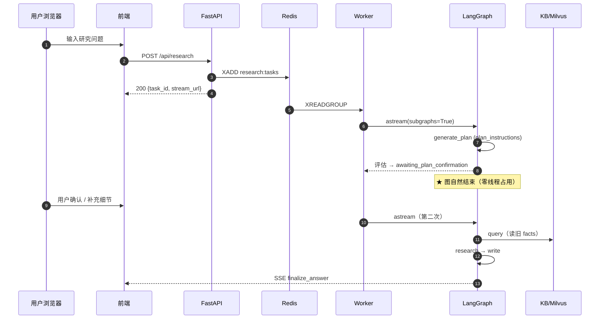

<div align="center">

# 🧠 DeepResearch

**基于 LangGraph 的多智能体深度研究后端 · HITL 计划确认 · KB 长期记忆 · SSE 流式响应**

[](https://www.python.org/)
[](https://langchain-ai.github.io/langgraph/)
[](https://fastapi.tiangolo.com/)
[](https://redis.io/)
[](https://milvus.io/)
[](LICENSE)
[](https://github.com/zhipo/deep-research)

[English](#-english-summary) · [简体中文](#-项目介绍) · [文档地图](docs/html/docs-map.html) · [架构概览](#-架构概览) · [快速开始](#-快速开始)

</div>

---

## 🌟 项目介绍

**DeepResearch** 是一个面向企业级深度研究场景的多智能体后端系统。用户输入一个研究问题，系统会通过 **多智能体协作 + 人在回路（HITL）+ 长期知识库（KB）+ 流式响应**，在数分钟内产出结构化的、引用引用的研究报告。

整个流程无需用户等待冷启动，也无需在多次迭代中重复输入背景信息 —— KB 长期记忆 + Redis 断点续传让"研究"这件事真正连续可中断。

### 🎯 核心特性

| 特性 | 说明 |
|------|------|
| 🤖 **多智能体编排** | 主图 + ResearchAgent + WriterAgent 双子图，状态机驱动 |
| 👤 **HITL 断点续传** | 透传 lambda 节点 + AsyncRedisSaver（7 天 TTL），用户可随时中断 |
| 📚 **KB 长期记忆** | Milvus 向量库 + 读旧写新闭环，置信度按 age 衰减且下限 0.3 |
| ⚡ **流式 SSE 响应** | 6 层流式链路（LLM → astream → on_token → emit → Redis → SSE），token 级实时推送 |
| 🚀 **并行研究** | LangGraph Send API + operator.add reducer，N 次搜索从 O(Nt) 降为 O(t) |
| 🛡️ **四重退出保险** | WriterAgent 防御 LLM Critic 自评偏差，循环可控退出 |
| 🎯 **LLM-as-Judge 评估** | 端到端 5 维 + 组件级 7 维独立打分，旁路观察不污染主链路 |
| 🌐 **优雅降级** | search_cache 内存降级 + KB 异常吞掉，主流程永不挂 |

---

## 🏗️ 架构概览

```mermaid
flowchart LR
    subgraph CLIENT["浏览器层"]
        UI["前端 UI<br/>(React + Vite)"]
    end

    subgraph API["API 层 · FastAPI :2024"]
        AUTH["AuthMiddleware"]
        SUBMIT["submit_research"]
        SSE_API["SSE Endpoint"]
    end

    subgraph QUEUE["任务队列层 · Redis Stream"]
        TASKS["research:tasks"]
        EVENTS["research:events:{id}"]
        CHECKPOINT["AsyncRedisSaver<br/>(7d TTL)"]
    end

    subgraph WORKER["Worker 协程"]
        PROCESS["_process_one_task"]
        ASTREAM["astream<br/>(subgraphs=True)"]
    end

    subgraph GRAPH["LangGraph 主图 + 子图"]
        GEN["generate_plan"]
        EVAL["evaluate_plan"]
        CONFIRM["confirm_plan"]
        HITL["awaiting_plan<br/>(HITL 暂停)"]
        RESEARCH["ResearchAgent<br/>generate_queries →<br/>web_search ×N → critique"]
        WRITE["WriterAgent<br/>outline → draft ↔<br/>critic → polish"]
    end

    subgraph BASE["基础类层"]
        AGENT["Agent / JsonAgent"]
        MCPA["WebSearchAgent<br/>(RateLimiter 12 QPS)"]
    end

    subgraph KB["KB 知识库层 · Milvus"]
        EXTRACT["FactExtractor"]
        STORE["FactStore<br/>(+ Rerank + 衰减)"]
    end

    UI --> AUTH --> SUBMIT --> TASKS
    TASKS --> PROCESS --> ASTREAM --> GRAPH
    RESEARCH --> AGENT --> MCPA
    RESEARCH --> EXTRACT --> STORE --> RESEARCH
    GRAPH --> EVENTS --> SSE_API --> UI
    CHECKPOINT -.->|7d TTL| GRAPH

    style GRAPH fill:#1a1438,stroke:#8b5cf6
    style KB fill:#0a1f15,stroke:#10b981
    style QUEUE fill:#1f0a0a,stroke:#ef4444
    style BASE fill:#241a08,stroke:#f59e0b
```



> 📐 完整 6 层分层架构与数据流详见 [docs/html/docs-map.html](docs/html/docs-map.html)（含 21 份文档索引、5 张 Mermaid 图、12 项亮点卡片）。

---

## ⚡ 快速开始

### 前置依赖

- Python ≥ 3.11
- Redis ≥ 7.0（需启用 Streams 模块）
- PostgreSQL ≥ 14（异步驱动 asyncpg）
- Milvus ≥ 2.5（向量库，可选；未启用时 KB 自动降级）
- DashScope MCP 服务账号（用于 web search，可选；未启用时研究模块报错但不阻塞 plan）

### 安装

```bash
# 1. 克隆仓库
git clone https://github.com/zhipo/deep-research.git
cd deep-research/backend

# 2. 安装依赖（推荐 uv）
curl -LsSf https://astral.sh/uv/install.sh | sh
uv sync --extra dev

# 3. 复制环境变量
cp .env.example .env
# 编辑 .env 填入 APP_TOKEN / LLM_BASE_URL / MCP_APP_ID 等

# 4. 启动 LangGraph 开发服务器（端口 2024）
langgraph dev
```

### 5 分钟体验

访问 [http://localhost:2024](http://localhost:2024) 即可使用 LangGraph Studio 调试。

调用一次端到端研究：

```bash
curl -X POST http://localhost:8123/api/research \
  -H "Content-Type: application/json" \
  -d '{
    "messages": [{"type": "human", "content": "对比 LangGraph 与 AutoGen 在多智能体编排上的设计差异"}],
    "initial_search_query_count": 3,
    "max_research_loops": 3,
    "reasoning_model": "qwen-plus-latest",
    "plan_status": "unconfirmed"
  }'
# 返回 {"task_id": "...", "stream_url": "/api/research/{id}/stream"}

# SSE 流式消费
curl -N http://localhost:8123/api/research/{task_id}/stream
```

---

## 🔧 配置说明

所有配置通过环境变量（`.env`）注入，关键变量如下：

| 变量 | 必填 | 说明 | 默认 |
|------|------|------|------|
| `APP_TOKEN` | ✅ | LLM API Key | — |
| `LLM_BASE_URL` | ✅ | LLM 服务 URL（OpenAI 兼容） | — |
| `MCP_APP_ID` | ✅ | DashScope MCP 应用 ID | — |
| `AVAILABLE_MODELS` | ❌ | 可用模型列表（JSON 数组） | Qwen-Flash/Plus/Max |
| `WEB_SEARCH_MAX_QPS` | ❌ | MCP 搜索 QPS 上限 | `12` |
| `NUMBER_OF_INITIAL_QUERIES` | ❌ | 初始搜索查询数（effort=medium） | `2` |
| `MAX_RESEARCH_LOOPS` | ❌ | 最大研究循环数 | `2` |

完整配置说明见 [模型配置说明.md](模型配置说明.md) 和 [速率限制配置说明.md](速率限制配置说明.md)。

---

## 📁 项目结构

```
backend/
├── src/
│   └── agent/
│       ├── graph.py               # 主图编排（197 行）
│       ├── base_agent.py          # Agent 框架（629 行，4 层继承）
│       ├── task_queue.py          # Worker 协程（XREADGROUP）
│       ├── prompts.py             # 提示词（含 plan_instructions）
│       ├── state.py               # OverallState TypedDict
│       ├── app.py                 # FastAPI 应用入口
│       ├── sub_agents/            # ResearchAgent / WriterAgent 子图
│       │   ├── research_agent.py  #   - KB 闭环 + 并行扇出
│       │   └── writer_agent.py    #   - 四重退出保险
│       ├── kb/                    # KB 知识库子系统
│       │   ├── fact_store.py      #   - Milvus 5 阶段 query 流水线
│       │   ├── extractor.py       #   - LLM 抽取原子事实
│       │   └── lifecycle.py       #   - 4 种 lifecycle 模式
│       └── llm/                   # LLM 客户端适配
├── eval/                          # LLM-as-Judge 评估子系统
│   ├── run_eval.py                #   - CLI 入口
│   ├── evaluator.py               #   - _CaptureCtx monkey-patch
│   ├── judge.py                   #   - 3 次重试 + Pydantic 校验
│   ├── prompts.py                 #   - 7 套评分提示词
│   └── test_set.json              #   - 10 个测试 topic
├── docs/
│   └── html/                      # 21 份架构文档 + docs-map.html
├── test/                          # 集成测试
├── scripts/                       # 运维脚本
├── langgraph.json                 # LangGraph 部署配置
├── pyproject.toml                 # 依赖与构建配置
└── README.md                      # ← 你正在读的这份
```

---

## 📚 文档导航

> 🗺️ **[docs/html/docs-map.html](docs/html/docs-map.html)** — 21 份详细文档的可视化索引，**建议先看这个**。

| 类别 | 文档 | 内容 |
|------|------|------|
| 🏗️ **核心架构** | [main-graph.html](docs/html/main-graph.html) | 主图 graph.py 详解（197 行） |
| | [base-agent.html](docs/html/base-agent.html) | Agent 框架（4 层继承 + RateLimiter） |
| | [research-agent.html](docs/html/research-agent.html) | ResearchAgent 子图 + KB 闭环 |
| | [writer-agent.html](docs/html/writer-agent.html) | WriterAgent 子图 + 四重保险 |
| ⚙️ **技术机制** | [astream-explained.html](docs/html/astream-explained.html) | LangGraph 流式执行引擎 |
| | [redis-operations.html](docs/html/redis-operations.html) | Redis 5 类 Key 操作全景 |
| | [fact-store.html](docs/html/fact-store.html) | FactStore 5 阶段 query |
| | [fact_extractor.html](docs/html/fact_extractor.html) | FactExtractor 抽取器 |
| 📋 **流程与 HITL** | [process-one-task.html](docs/html/process-one-task.html) | Worker 协程完整解析 |
| | [post-api-research.html](docs/html/post-api-research.html) | API 链路 |
| | [hitl_awaiting_plan_confirmation.html](docs/html/hitl_awaiting_plan_confirmation.html) | HITL 流转深度 |
| | [generate_plan_docs.html](docs/html/generate_plan_docs.html) | generate_plan 节点详解 |
| | [hitl_interaction_flow.md](docs/html/hitl_interaction_flow.md) | 真实端到端交互案例 |
| 🧩 **子图与提示词** | [prompts/plan_instructions.html](docs/html/prompts/plan_instructions.html) | 5 步澄清循环 + 5 大要素 |
| | [main_graph/confirm_plan.html](docs/html/main_graph/confirm_plan.html) | confirm_plan 节点 |
| | [subagent_researcher/generate-queries.html](docs/html/subagent_researcher/generate-queries.html) | 查询生成（含 KB 去重） |
| | [subagent_writer/web_search.html](docs/html/subagent_writer/web_search.html) | 单条查询处理 7 步流水线 |
| 🧪 **评估与索引** | [eval/index.html](docs/html/eval/index.html) | LLM-as-Judge 评估详解 |
| | [kb/index.html](docs/html/kb/index.html) | KB 子系统完整说明 |

---

## 🧪 评估与测试

### 跑一次端到端评估

```bash
cd backend
python -m eval.run_eval \
  --eval-model qwen-plus-latest \
  --test-set eval/test_set.json \
  --output eval_report_$(date +%Y%m%d_%H%M%S).json
```

### 测试集

`eval/test_set.json` 包含 10 个 topic：
- 5 个基础场景（科技/产品/政策/产业/方法论）
- 5 个需求澄清场景（带 user_feedback 模拟）

### 评分量纲

| 分数段 | 颜色 | 含义 |
|--------|------|------|
| 4.0 – 5.0 | 🟢 优秀 | 可上线 |
| 3.0 – 3.9 | 🟢 合格 | 可发布 |
| 2.0 – 2.9 | 🟠 较差 | 需调优 |
| 1.0 – 1.9 | 🔴 不可用 | 必须重做 |

### 集成测试

```bash
pytest test/ -v
```

---

## 🎨 端到端数据流（9 步）



---

## 🛣️ 路线图

- [ ] **显式 Interrupt**：用 LangGraph `interrupt_before + checkpointer + Command(resume)` 替代当前隐式契约
- [ ] **per-fact 容错**：FactExtractor 在 JSON 解析失败时跳过单条而非整批丢弃
- [ ] **KB 去重**：同 topic 同 fact 写入前相似度去重
- [ ] **可观测性**：Prometheus metrics + LangSmith 全链路 trace
- [ ] **多语言**：除中文外支持英文/日文 deep research 提示词
- [ ] **插件化 Agent**：让用户自定义子 Agent 接入研究流水线

---

## 🤝 贡献

欢迎 PR / Issue！建议先看 [docs/html/docs-map.html](docs/html/docs-map.html) 了解项目全貌，再针对性修改对应模块的文档 + 代码。

代码风格：
- `ruff` linting（`ruff check src/`）
- `mypy` type checking（`mypy src/`）
- 测试覆盖：`pytest test/` 须通过

---

## 📄 License

[MIT](LICENSE) © 2026 

---

## 👤 Author

**DeepResearch** 由 [Cai.He](https://github.com/hochoy18) 设计并实现。

- 📧 联系：项目内 Issue
- 🌟 如果这个项目对你有帮助，欢迎 Star！

---

<div align="center">

### 🌐 English Summary

**DeepResearch** is a multi-agent deep research backend built on LangGraph. It supports Human-in-the-Loop (HITL) plan confirmation, KB long-term memory (Milvus vector DB with read-old-write-new closed loop), and SSE streaming responses. Key design highlights: master graph + ResearchAgent / WriterAgent subgraphs, AsyncRedisSaver checkpoint (7-day TTL) for resume, Send API for O(N)→O(1) parallel fan-out, four-fold exit insurance defending against LLM self-review bias, and a side-channel LLM-as-Judge evaluation framework (5 e2e + 7 component dimensions). Tech stack: Python 3.11, LangGraph, FastAPI, Redis Stream, Milvus, DashScope MCP. See [`docs/html/docs-map.html`](docs/html/docs-map.html) for the complete 21-document architecture index.

</div>